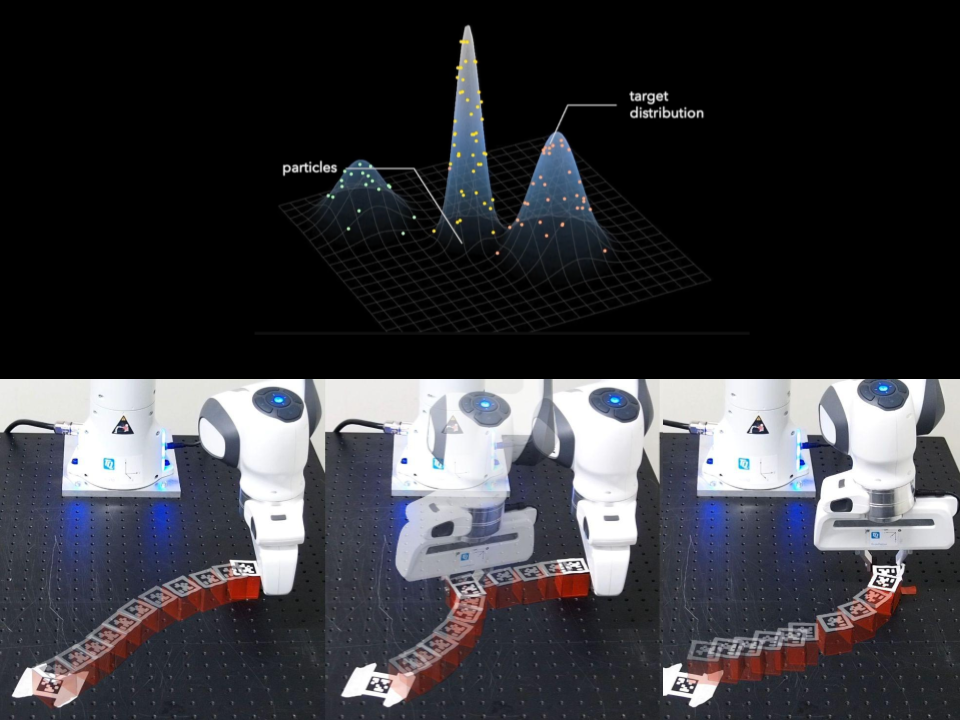

## About Me

I am a Ph.D. student in Computer and Information Science (CIS) at the [GRASP Laboratory](https://www.grasp.upenn.edu/) at the University of Pennsylvania, where I am advised by Prof. [Rachel Holladay](https://www.seas.upenn.edu/~rhollada/). My research interest centers around decision making, planning, and control for robot manipulation, particularly in contact-rich, long horizon settings. 

I obtained my Master's in Computer Science at the University of Toronto, where I was advised by Prof. [Florian Shkurti](http://www.cs.toronto.edu/~florian/) and collaborated with Prof. [Fabio Ramos](https://fabioramos.github.io/Home.html). For my Master's thesis, I developed a differentiable algorithm for task and motion planning that makes use of gradients from physics simulation. Prior to that, I completed my bachelor's in [Engineering Science](https://engsci.utoronto.ca/program/what-is-engsci/) at the University of Toronto. During this time, I interned at Epson's Robotics R&D team researching computer vision algorithms for robotic manipulation.

I am gratefully supported by the [NSERC Canada Graduate Scholarship - Doctoral](https://nserc-crsng.canada.ca/en/funding-opportunity/canada-graduate-research-scholarship-doctoral-program), and have been honored to receive the [Google DeepMind Fellowship](https://www.deepmind.com/education), [NSERC Canada Graduate Scholarship (Master's)](https://www.nserc-crsng.gc.ca/students-etudiants/pg-cs/cgsm-bescm_eng.asp), and [Ontario Graduate Scholarship](https://osap.gov.on.ca/OSAPPortal/en/A-ZListofAid/PRDR019245.html) for my Master's studies. 

## News
- [September 2025] Awarded the NSERC Canada Graduate Scholarship for my PhD
- [March 2025] Our work on differentiable task and motion planning ([STAMP](https://rvl.cs.toronto.edu/stamp/)) has been accepted to RA-L 2025
- [October 2023] My workshop paper on Differentiable TAMP was accepted to the [LEAP Workshop](https://leap-workshop.github.io) at CoRL 2023
- [July 2023] Selected to attend Robotics: Science and Systems 2023 as an [Inclusion Fellow](https://sites.google.com/seas.upenn.edu/inclusion-rss-2023/program)
- [July 2023] Awarded the Ontario Graduate Scholarship

<h2 id="publications" style="margin: 2px 0px -15px;">Publications <temp style="font-size:15px;"></temp></h2>

  <ol class="bibliography">
    <li>
      

        

          
        

        

          

            <a href="https://arxiv.org/pdf/2310.01775.pdf">STAMP: Differentiable Task and Motion Planning via Stein Variational Gradient Descent</a>
          

          

            <strong>Yewon Lee</strong>, Andrew Z. Li, Philip Huang, Eric Heiden, Krishna Murthy Jatavallabhula, Fabian Damken, Kevin Smith, Derek Nowrouzezahrai, Fabio Ramos, Florian Shkurti
          

          

            <em>To Appear in IEEE Robotics and Automation Letters <strong>(RA-L)</strong>, 2025.</em>
          

          

            <em>Conference on Robot Learning <strong>(CoRL)</strong>, Learning Effective Abstractions for Planning Workshop, 2023.</em>
          

          

            <a href="https://rvl.cs.toronto.edu/stamp/" class="btn btn-sm z-depth-0" role="button" target="_blank" style="font-size:12px;">Website</a>
            <a href="https://arxiv.org/abs/2310.01775" class="btn btn-sm z-depth-0" role="button" target="_blank" style="font-size:12px;">arXiv</a>
            <a href="https://www.youtube.com/watch?v=FuFGdixlSnM" class="btn btn-sm z-depth-0" role="button" target="_blank" style="font-size:12px;">Video</a>
            <a href="https://drive.google.com/file/d/1BAc1qalsh1JuERrc7yWq3H7i0NmiB881/view?usp=sharing" class="btn btn-sm z-depth-0" role="button" target="_blank" style="font-size:12px;">Poster</a>
          

        
 <!-- Closes col-sm-9 -->
      
 <!-- Closes pub-row -->
    </li>
  </ol>

